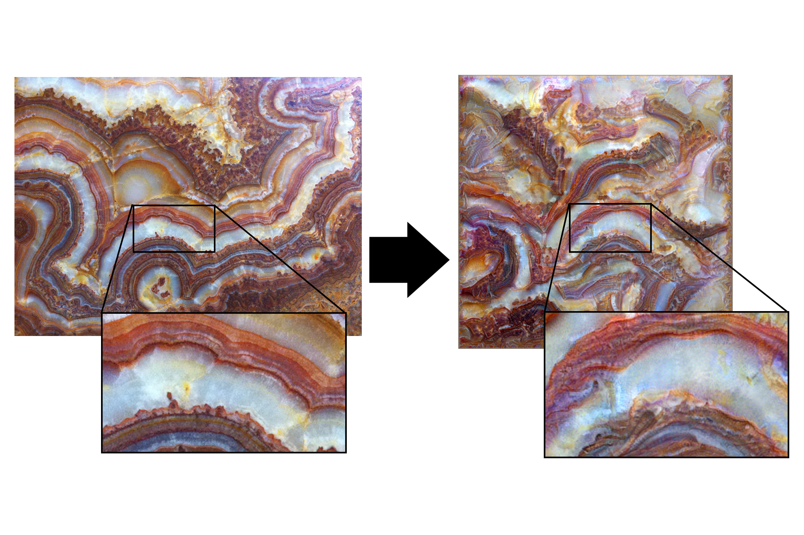

# Subjective functions
## Multi-scale neural texture synthesis

By using a Gaussian pyramid and extracting Gatys-style "style" descriptors
using the Gramian of intermediate VGG layers for each spatial scale in the
pyramid, we can create much higher-resolution images, with structure at
multiple image scales, not necessarily aligned with the receptive field of the
layers of Gatys.



This code will hopefully, one day, improve. I've rushed it online pre-publication for a [workshop at InterAccess](http://interaccess.org/workshop/2017/jul/objective-functions-creating-images-neural-networks)

## Quickstart

Install the pre-requisites

    pip install -r requirements.txt

Run locally (this will likely be very slow as it runs on your GPU)

    python3 synthesize.py -s bark.jpg

Look for output files inside the "outputs" directory that will be created by this command.

### Run in FloydHuh

To quickly run this on a GPU if you have an account with FloydHub you can run;

    floyd init subjective-functions

then try:

    floyd run --gpu "python3 synthesize -s bark.jpg -s bark.jpg --data-dir /vgg_weights --output-dir /output" --data wxswxs/vgg-weights/1:vgg_weights

## Configuration

Most immediately useful flags:

    -s - Path to source texture image
    --output-width, --output-height, output dimensions in pixels


To see all the other flags run

    python3 synthesize.py -h

which, as of this writing, outputs:

```
usage: synthesize.py [-h] [--output-width OUTPUT_WIDTH]
                     [--output-height OUTPUT_HEIGHT] [--octaves OCTAVES]
                     [--layers LAYERS [LAYERS ...]] [--max-iter MAX_ITER]
                     [--output-prefix OUTPUT_PREFIX] [--save-every SAVE_EVERY]
                     [--source-scale SOURCE_SCALE]
                     [--source-width SOURCE_WIDTH]
                     [--padding-mode {valid,same}] [--join-mode {average,max}]
                     [--count COUNT] [--mul MUL] [--if-weight IF_WEIGHT]
                     [--if-shift IF_SHIFT] [--if-order IF_ORDER]
                     [--seed {random,symmetric}] [--data-dir DATA_DIR]
                     [--output-dir OUTPUT_DIR] [--tol TOL] --source SOURCE
                     [SOURCE ...]

Synthesize image from texture

optional arguments:
  -h, --help            show this help message and exit
  --output-width OUTPUT_WIDTH, -ow OUTPUT_WIDTH
                        Pixel width of generated image (default: 512)
  --output-height OUTPUT_HEIGHT, -oh OUTPUT_HEIGHT
                        Pixel height of generated image. If not specified,
                        equal to output-width. (default: None)
  --octaves OCTAVES, -o OCTAVES
                        Number of octaves (where 1 means "Consider only 1
                        scale") (default: 4)
  --layers LAYERS [LAYERS ...], -l LAYERS [LAYERS ...]
                        Which layers to match gram matrices on (default: [2,
                        7])
  --max-iter MAX_ITER, -m MAX_ITER
                        Maximum iterations for the L-BFGS-B optimizer
                        (default: 500)
  --output-prefix OUTPUT_PREFIX, -op OUTPUT_PREFIX
                        Prefix to append to output directory (default: out)
  --save-every SAVE_EVERY, -n SAVE_EVERY
                        Save an in-progress optimization image every
                        SAVE_EVERY iterations (default: 10)
  --source-scale SOURCE_SCALE, -ss SOURCE_SCALE
                        How much to scale the source image by (default: None)
  --source-width SOURCE_WIDTH, -sw SOURCE_WIDTH
                        Scale source to this width. Mutually exclusive with
                        source-scale (default: None)
  --padding-mode {valid,same}, -p {valid,same}
                        What boundary condition to use for convolutions
                        (default: valid)
  --join-mode {average,max}, -j {average,max}
                        How to combine gram matrices when multiple sources
                        given (default: average)
  --count COUNT, -c COUNT
                        How many images to generate simultaneously (default:
                        1)
  --mul MUL             Multiply target grams by this amount (default: 1.0)
  --if-weight IF_WEIGHT
                        Inter-frame loss weight (default: 1.0)
  --if-shift IF_SHIFT   How many pixel-shift should inter-frame loss
                        approximate? (default: 5.0)
  --if-order IF_ORDER   How many frames should we 'tie' together? (default:
                        2.0)
  --seed {random,symmetric}
                        How to seed the optimization (default: random)
  --data-dir DATA_DIR, -d DATA_DIR
                        Where to find the VGG weight files (default:
                        model_data)
  --output-dir OUTPUT_DIR
                        Where to save the generated outputs (default: outputs)
  --tol TOL             Gradient scale at which to terminate optimization
                        (default: 1e-09)
  --source SOURCE [SOURCE ...], -s SOURCE [SOURCE ...]
                        List of file to use as source textures (default: None)
```


